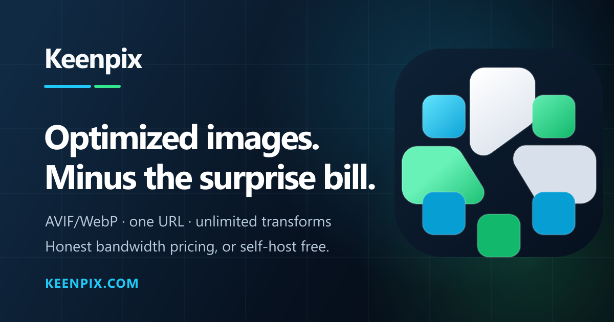

# Keenpix



Keenpix is a self-hosted image optimization layer for teams that want the speed of an image CDN without handing the pipeline to another service. Point it at an allowlisted origin, request one URL, and Keenpix fetches the image, transforms it with [sharp](https://sharp.pixelplumbing.com/), caches the variant to disk, records analytics, and serves a CDN-ready response.

It is built for operators who want the important parts kept visible: project allowlists, request logs, disk cache behavior, and deployment configuration all live in your own stack.

Don't want to run it yourself? The same engine is available as a managed cloud at [keenpix.com](https://keenpix.com) — one managed-delivery meter, unlimited transforms and team members, and a 14-day free trial. The cloud funds the open-source work.

## What Keenpix ships

- **Transform API** - `GET /img/https://origin.example/photo.jpg?project=...&w=...&fmt=...` resizes, crops, filters, re-encodes, negotiates modern formats, and returns immutable cache headers.
- **No public API keys** - access is gated by each project's domain allowlist. An empty allowlist fails closed with 403, so a fresh project is never an open proxy.
- **Internal API keys** - trusted backend systems can manage projects, domains, and pipeline settings through authenticated JSON endpoints.
- **Projects and origins** - each project owns its source host rules, settings, request logs, and analytics.
- **Built-in analytics** - requests, bandwidth saved, cache hit rate, output formats, latency, top images, and source domains come from Postgres rollups fed by the request log; optional Cloudflare edge analytics show the cache layer in front.
- **Self-host dashboard** - seeded super admin, staff invitations, project settings, API keys, Cloudflare edge analytics, and operational views. Transactional email is configured via `EMAIL_PROVIDER` (Postmark / Resend / SMTP) in the environment.
- **Open-internet hardening** - allowlist checks, private/loopback/link-local/CGNAT blocking, IPv4-mapped IPv6 handling, DNS rebinding protection, response-size limits, decompression-bomb limits, and transform back-pressure.

Stack: TanStack Start (React 19, SSR) · Prisma 7 + PostgreSQL · sharp · Docker. AGPL-3.0 licensed.

---

## Code style

Keenpix keeps helpers and utils scoped by folder and purpose:

- `helpers/<domain>/` is for pure domain helpers with real parsing, composition, or validation behavior. Do not put broad catch-all files like `helpers/admin.ts` here.
- `utils/<primitive>/` is for pure generic primitives, not product-specific response shaping.
- Do not extract functions that only return object literals or forward fields. Keep that code in the owning module unless the helper removes real logic or validation edge cases.
- Use operation verbs precisely: `getProject` for one identified project, `listProjects` for a collection, and explicit mutation/check verbs such as `create`, `update`, `delete`, `verify`, `enable`, `disable`, `add`, and `remove`.
- `data-access/` talks to the database; `actions/` combine data-access/helpers/utils/integrations into use cases; `functions/` validate, authorize, shape entry/exit data, and call actions.
- Function complexity lint rules are disabled on purpose. Prefer readable local control flow over splitting code only for a metric.

See [AGENTS.md](./AGENTS.md) and [src/README.md](./src/README.md) for the full repository rules.

---

## Quick start (Docker — the self-host path)

Requires Docker + Docker Compose.

```bash
cp .env.example .env
# Generate a signing secret and put it in .env (compose refuses to start without one):
#   openssl rand -hex 32   →   BETTER_AUTH_SECRET=...
# Set POSTGRES_PASSWORD, KEENPIX_SUPER_ADMIN_EMAIL, and KEENPIX_SUPER_ADMIN_PASSWORD in .env.
docker compose up -d
```

The app comes up on **http://localhost:3000** by default. Set `KEENPIX_PORT` to publish a different host port, `BETTER_AUTH_URL` to your public base URL, or `KEENPIX_IMAGE` to a pinned image tag/digest. Compose runs Postgres, applies migrations on boot, seeds the default org and super admin user, and exposes `/api/health` for the container healthcheck. Self-host is the default (`KEENPIX_MODE` unset), so `/` shows a private self-host splash with links into `/app` and `/docs`; the dashboard, API, and docs are served, while public marketing and LLM export routes are not.

The Docker image entrypoint accepts `start` (default), `migrate`, and `seed`. For normal installs, leave the default `start`; it applies migrations, seeds bootstrap data, then starts the app. Set `KEENPIX_RUN_MIGRATIONS=false` or `KEENPIX_RUN_SEED=false` only when an external deployment workflow owns those steps.

## Quick start (Coolify)

Use [docker-compose.coolify.yml](./docker-compose.coolify.yml) for a Coolify service stack.

1. In Coolify, create a new resource with **Docker Compose Empty**.
2. Paste the contents of `docker-compose.coolify.yml`.
3. Set your public domain on the `app` service. Coolify will generate `SERVICE_URL_APP`, database credentials, the auth secret, and the super-admin password. `BETTER_AUTH_URL` and `KEENPIX_APP_URL` are inferred from `SERVICE_URL_APP`, which must match the browser-facing URL without the container port.
4. Optionally change `KEENPIX_SUPER_ADMIN_EMAIL` from the default `admin@example.com`.
5. Deploy, then sign in with `KEENPIX_SUPER_ADMIN_EMAIL` and the generated `SERVICE_PASSWORD_64_ADMIN` value shown in Coolify's environment variables.

The Coolify stack defaults to `ghcr.io/lord007tn/keenpix:latest`, keeps Postgres private, persists database/cache volumes, runs migrations and seed on app startup, and exposes the app through Coolify's proxy on container port `3000`. Set `KEENPIX_IMAGE` to pin a specific tag or digest when you want controlled rollouts.

If an earlier Coolify deploy failed with a Postgres 18 message about existing data in `/var/lib/postgresql/data`, remove the failed `keenpix-pg` volume from that Coolify resource or recreate the resource before deploying this compose. The Coolify compose now uses a fresh `keenpix_pg18` volume mounted at `/var/lib/postgresql`, which is the Postgres 18-compatible layout.

**First run (empty database):**
1. Open http://localhost:3000 and sign in with `KEENPIX_SUPER_ADMIN_EMAIL` and `KEENPIX_SUPER_ADMIN_PASSWORD`.
2. Create a **project** (its origin hostname is added to the allowlist automatically).
3. In **Settings**, invite staff by copying an invitation link. To email those invitations, set `EMAIL_PROVIDER` (and its vars) in the environment.
4. Add any other image hosts under **Allowed hosts**, and copy the **Project ID** (shown at the top of Settings).
5. Request an image — **no API key**, just make sure the source host is allowlisted:
   ```bash
   curl -o out.webp \
     "http://localhost:3000/img/https://your-cdn.example.com/photo.jpg?project=<PROJECT_ID>&w=600&fmt=webp"
   ```

---

## Quick start (local dev)

Requires Node 22+, pnpm, and a PostgreSQL database.

```bash
pnpm install
cp .env.example .env          # point DATABASE_URL at your Postgres
                              # and set KEENPIX_SUPER_ADMIN_EMAIL / KEENPIX_SUPER_ADMIN_PASSWORD
pnpm db:migrate               # apply schema
pnpm db:seed                  # seed default org + admin user
pnpm dev                      # http://localhost:3000
```

---

## Configuration

All via environment variables (see `.env.example`):

| Variable | Required | Purpose |
|---|---|---|
| `DATABASE_URL` | ✅ | PostgreSQL connection string. |
| `POSTGRES_PASSWORD` | ✅ (compose) | Password for the bundled Compose Postgres service. Compose refuses to start without it. |
| `BETTER_AUTH_SECRET` | ✅ (prod) | Session signing secret — `openssl rand -hex 32`. The app refuses to boot in production with a missing or known-weak/placeholder value. |
| `BETTER_AUTH_URL` | – | Public base URL (default `http://localhost:3000`). HTTPS enables secure cookies automatically. |
| `KEENPIX_APP_URL` | – | Canonical URL used for hosted docs metadata and generated OG/LLM links. Defaults to `BETTER_AUTH_URL`. |
| `KEENPIX_SUPER_ADMIN_EMAIL` | ✅ | Email for the seeded super admin account. |
| `KEENPIX_SUPER_ADMIN_PASSWORD` | ✅ | Password for the seeded super admin account. |
| `KEENPIX_ADMIN_EMAIL` / `KEENPIX_ADMIN_PASSWORD` | – | Legacy aliases for the super-admin bootstrap variables. |
| `LOG_LEVEL` | – | Server log level (`info` by default). |
| `VITE_KEENPIX_PUBLIC_URL` | – | Browser-facing app URL for local/source builds when it cannot be inferred from the browser origin. |
| `VITE_GTM_CONTAINER_ID` | – | Primary consent-gated Google Tag Manager container ID. The published container must contain an unpaused Google tag and event routing; setting the ID alone does not route events. Because Vite embeds this value at build time, set it as both a Docker build argument and a runtime variable in cloud deployments. |
| `VITE_GA_MEASUREMENT_ID` | – | Consent-gated direct GA4 fallback used only when GTM is unset. Set it at both Docker build time and runtime. |
| `EMAIL_PROVIDER` | – | Selects the one active email provider: `postmark`, `resend`, or `smtp`. Unset disables email. The selected provider's vars are validated at startup. |
| `POSTMARK_API_KEY` / `POSTMARK_FROM` / `POSTMARK_MESSAGE_STREAM` | – | Postmark credentials (when `EMAIL_PROVIDER=postmark`). |
| `RESEND_API_KEY` / `RESEND_FROM` | – | Resend credentials (when `EMAIL_PROVIDER=resend`). |
| `SMTP_HOST` / `SMTP_PORT` / `SMTP_SECURE` / `SMTP_USER` / `SMTP_PASSWORD` / `SMTP_FROM_EMAIL` / `SMTP_FROM_NAME` | – | SMTP connection (when `EMAIL_PROVIDER=smtp`; `SMTP_HOST` + `SMTP_FROM_EMAIL` required). |
| `CLOUDFLARE_API_TOKEN` / `CLOUDFLARE_ACCOUNT_API_TOKEN` / `CLOUDFLARE_ACCOUNT_ID` / `CLOUDFLARE_ZONE_ID` | – | Optional Cloudflare edge analytics fallback when Settings → CDN cache is not enabled. Use zone **Analytics → Read** for `CLOUDFLARE_API_TOKEN` and account **Account Analytics → Read** for `CLOUDFLARE_ACCOUNT_API_TOKEN`; the account token falls back to the zone token for combined credentials. |
| `CLOUDFLARE_HOST` | – | Optional hostname filter for Cloudflare edge analytics when one zone serves multiple `/img/*` hosts. |
| `CLOUDFLARE_SAAS_API_TOKEN` / `CLOUDFLARE_SAAS_ZONE_ID` / `CLOUDFLARE_SAAS_CNAME_TARGET` / `CLOUDFLARE_SAAS_EDGE_SECRET` | – | Managed-cloud custom delivery domains. Configure the fallback origin and edge Worker first. The token needs zone **SSL and Certificates → Edit** and **Workers Routes → Edit**. |
| `CLOUDFLARE_SAAS_WORKER_SCRIPT` | `keenpix-custom-domain-edge` | Worker that securely forwards exact customer-hostname routes to the canonical Keenpix origin. |
| `KEENPIX_MODE` | – | `selfhost` (default) or `cloud`. Self-host is single-tenant with no public marketing site, self-signup, or billing. |
| `KEENPIX_RUN_MIGRATIONS` / `KEENPIX_RUN_SEED` | – | Docker entrypoint controls for running migrations and bootstrap seed before app start. Defaults to `true`. |
| `KEENPIX_CACHE_DIR` | – | Disk cache location (default `./.keenpix-cache`). |
| `KEENPIX_CACHE_MAX_BYTES` | – | LRU eviction cap. The app default is 2 GB; the Docker/Coolify compose files default to 8 GB for CDN-fronted origin-shield use. |
| `KEENPIX_CACHE_STALE_MS` | – | Serve cached variants immediately after this age and refresh them in the background; `0` disables internal stale refresh. Default 24h. |
| `KEENPIX_MEMORY_CACHE_MAX_BYTES` | – | In-process hot variant LRU cap; set `0` to disable. The app default is 64 MB; the Docker/Coolify compose files default to 256 MB. |
| `KEENPIX_MAX_ORIGIN_BYTES` | – | Reject origin responses larger than this (default 50 MB). |
| `KEENPIX_MAX_INPUT_PIXELS` | – | Decompression-bomb ceiling (default ~50 MP). |
| `KEENPIX_MAX_DIMENSION` | – | Longest output side when a request omits `w`/`h` (default 4096). |
| `KEENPIX_ORIGIN_TIMEOUT_MS` | – | Per-attempt origin fetch timeout; a slow origin returns 504 (default 10000). |
| `KEENPIX_MAX_CONCURRENCY` / `KEENPIX_MAX_QUEUE` | – | Concurrent transform jobs / queue depth before shedding 503. |
| `KEENPIX_MEM_LIMIT` / `KEENPIX_CPU_LIMIT` / `KEENPIX_MEM_RESERVATION` | – | Opt-in Docker Compose resource caps for the app container. Default `0` = no limit. When set, Docker enforces them and the Operations page CPU/RAM gauges read the cap as the real ceiling. A too-low memory cap can get the app OOM-killed. |
| `KEENPIX_PG_MEM_LIMIT` / `KEENPIX_PG_CPU_LIMIT` / `KEENPIX_PG_MEM_RESERVATION` | – | Same opt-in resource caps for the bundled Postgres container. Default `0` = no limit. |

The cloud usage job also captures project-attributed Cloudflare `/img/*` edge
history hourly. Billing counts every successful response once regardless of
whether Cloudflare, Keenpix's optimized-variant cache, or a new origin transform
serves it: an edge hit is counted at the edge, while an edge miss is counted only
when the application returns it. Optimizer savings (`bytesSaved`) remain a
separate analytics measure and are never added to delivered bytes. Customer
analytics remain organization/project scoped. See
[`docs/analytics-history.md`](docs/analytics-history.md) for retention, export,
coverage, and the prospective project-attributed edge design.

---

## Transform API

```
GET /img/<origin-url>?project=<id>&w=&h=&q=&fmt=&fit=&dpr=&blur=&...
```

**No authentication header.** Access is controlled by the project's allowlist — the request only succeeds if the source URL's host is listed under that project's **Allowed hosts**.

| Param | Meaning |
|---|---|
| `project` | Project id (copy it from **Settings → Project ID**). Its allowlist is the gate. |
| path source | Source image URL after `/img/` — its host must be on the project allowlist. |
| `w` / `h`, `resize` / `s` | Target width/height (1–5000). `resize`/`s` accept `WIDTHxHEIGHT`, `WIDTH`, or `xHEIGHT`. |
| `q` | Quality 30–100 (default 75). |
| `fmt` | `auto` (Accept-negotiated), `avif`, `webp`, `jpeg`, `png`, `gif`, `heif`, `tiff`, `svg`. |
| `fit` | `cover` / `contain` / `fill` / `inside` / `outside`. |
| `position` / `pos` / `gravity` | Crop anchor for `cover`/`contain`: edges, corners, compass gravity, `entropy`, or `attention`. |
| `dpr` | Device pixel ratio 1–3. |
| `enlarge` | Allows upscaling when set to `1`/`true`; omitted requests do not upscale. |
| `kernel` | Resize kernel: `nearest`, `linear`, `cubic`, `mitchell`, `lanczos2`, `lanczos3`, `mks2013`, `mks2021`. |
| `background` / `bg`, `flatten` | Fill color and alpha flattening controls. |
| `extract` / `crop`, `trim`, `extend`, `extendWith` | Exact crop rectangle, edge trim, and output padding controls. |
| `rotate` / `r`, `flip`, `flop` | Arbitrary rotation and vertical/horizontal mirroring. |
| `blur`, `sharpen`, `median`, `gamma`, `negate`, `normalize`, `threshold` | Pixel filters and corrections. |
| `brightness`, `saturation`, `hue`, `lightness`, `tint`, `grayscale` / `greyscale` | Color adjustment controls. |
| `animated` / `a` | Preserve animated GIF/WebP frames when output supports them. |

Simple source URLs can be written directly in the path. If the source URL contains its own `?` or `#`, URL-encode the source before appending Keenpix transform parameters.

Responses set `Cache-Control: public, max-age=31536000, immutable` and `Vary: Accept`, so a CDN can cache each image variant once you configure it to cache `/img/*` with the full query string. The source URL lives in the path so Cloudflare and other CDNs can still see the source file extension; use omitted `fmt` / `fmt=auto` only when your CDN can cache separate `Accept` variants, and use explicit `fmt` values when you intentionally want a fixed output format.

Keenpix also supports internal stale-while-revalidate for the disk cache. After `KEENPIX_CACHE_STALE_MS`, a cached variant is still served immediately and a refresh is queued in the background. This keeps user-facing p95 low while allowing long-lived variants to be refreshed from the origin.

For good cache hit rates, keep frontend widths normalized. Instead of generating arbitrary widths from every viewport value, choose a small shared ladder such as `320`, `480`, `640`, `768`, `960`, and `1280`, then reuse those values across your CMS and frontend. Each unique `src + project + w + h + q + fmt + fit + dpr + blur` combination is a separate variant.

For Cloudflare, create a Cache Rule matching `http.host eq "keenpix.com" and starts_with(http.request.uri.path, "/img/")` that marks responses eligible for cache. On non-Enterprise plans, leave the Cache key section unset; Cloudflare's default/standard cache key already includes the full request URI with query string, so each `?w=` / `?fmt=` variant is cached separately. Do not enable "Ignore query string". If using `fmt=auto`, the cache key also needs to vary by `Accept`, which requires custom cache-key header support; otherwise prefer explicit `fmt=avif` / `fmt=webp` URLs from integrations.

On Keenpix Cloud, Pro and Business customers can connect branded delivery
hostnames under Settings → Custom domains. Once the displayed CNAME is active,
`https://images.customer.com/img/<source-url>` resolves the associated project
without exposing `?project=`. Self-hosters configure the same host routing and
TLS behavior in their own reverse proxy.

Framework image components usually map their `format` prop directly to `fmt`. Leave that prop unset for browser-based AVIF/WebP negotiation; `format="avif"` or `format="webp"` forces that format.

`fmt=auto` is raster negotiation only, even for SVG origins: Keenpix rasterizes through Sharp and returns AVIF, WebP, or JPEG from the `Accept` header. Only explicit `fmt=svg` returns `image/svg+xml`; it serves SVG origins through SVGO optimization and active-content stripping, and raster transform modifiers do not apply to SVG output.

### IPX modifier comparison

Keenpix is remote-origin and project-allowlist oriented rather than a storage-provider router, but its Sharp modifier surface now covers the practical IPX-style image operations.

| IPX-style capability | Keenpix support | Notes |
|---|---|---|
| `w`, `h`, `q`, `fmt`, `fit`, `dpr`, `blur` | Supported | Original focused surface. |
| `position` / `pos` / `gravity` | Supported | Includes edges, corners, compass gravity, `entropy`, and `attention`. |
| `background` | Supported | Used by `contain`, `flatten`, `extend`, and arbitrary rotate. |
| `flatten` | Supported | Merges alpha onto the configured background. |
| `fit=outside` | Supported | Sharp `outside` fit mode. |
| `resize` / `s=WxH` | Supported | Compact aliases; explicit `w`/`h` take priority. |
| `enlarge` | Supported, opt-in | Default remains no-upscale. |
| `kernel` | Supported | Sharp resize kernels. |
| `extract` / `crop` | Supported | `left,top,width,height`. |
| `trim` | Supported | Boolean or threshold. |
| `extend` | Supported | CSS-like one, two, or four-value padding. |
| arbitrary `rotate` | Supported | EXIF auto-orient still runs first. |
| `flip` / `flop` | Supported | Vertical / horizontal mirror. |
| `sharpen`, `median`, `gamma` | Supported | Conservative numeric ranges. |
| `negate`, `normalize`, `threshold` | Supported | Boolean and threshold controls. |
| `modulate`, `tint`, `grayscale` | Supported | Brightness/saturation/hue/lightness, tint, grayscale. |
| `animated` / `a` | Supported | Enables Sharp animated decoding. |
| Extra formats | Supported | Adds `gif`, `heif`, `tiff`, and explicit `svg` alongside `avif`, `webp`, `jpeg`, `png`. |
| SVGO/SVG optimization | Supported | `fmt=svg` optimizes SVG origins with SVGO and strips active content; `fmt=auto` still returns a negotiated raster format. |
| Local/storage providers | Product-scope difference | Keenpix intentionally uses remote origins gated by project allowlists instead of filesystem/Unstorage providers. |

**Failure modes:**

| Status | When |
|---|---|
| **400** | Missing source URL or `?project`, or a malformed/non-http(s) URL |
| **403** | Source host not on the project allowlist (or the allowlist is empty), it resolves to a private/loopback/link-local/CGNAT/multicast address (incl. IPv4-mapped IPv6 and DNS-rebinding), or the project requires signed URLs and `sig` is missing/invalid |
| **404** | Unknown `project` id |
| **413** | Origin image exceeds `KEENPIX_MAX_ORIGIN_BYTES` |
| **502** | Origin unreachable, errored, returned a non-image body, or too many redirects |
| **503** | Transform queue saturated (back-pressure) |
| **504** | Origin timed out |

In an ``, any non-200 shows as a broken image — a 403 almost always means the source host isn't on the allowlist.

---

## SDK API

SDK API keys are for trusted backend integrations such as JoodCMS. They are separate from the public image transform flow: `/img/*` still uses project allowlists and does not require an authentication header.

Create a key from **Settings → API keys** as a super admin. Keys can be scoped to every project or to a single project. Project scope is stored on the Better Auth API key metadata, so no custom token table is used. Project-scoped keys can only read or write that project and cannot create new projects. The key is shown once. Send it as either:

```bash
Authorization: Bearer <KEY>
# or
X-Keenpix-Api-Key: <KEY>
```

All SDK endpoints live under `/api/sdk`, return JSON, and use `Cache-Control: no-store`. The self-host build currently uses the default org (`org_default`) for SDK project operations.

| Method | Path | Purpose |
|---|---|---|
| `GET` | `/api/sdk/projects` | List projects visible to the key. All-project keys see all default-org projects; project-scoped keys receive only their project. |
| `POST` | `/api/sdk/projects` | Create a project. All-project write key required. Body: `name`, `origin`, `env`, optional `allowedOrigins`. |
| `GET` | `/api/sdk/projects/<projectId>` | Fetch one project. |
| `GET` | `/api/sdk/projects/<projectId>/configuration` | Fetch integration-safe image configuration for clients such as JoodCMS. |
| `PATCH` | `/api/sdk/projects/<projectId>/settings` | Update transform defaults. Body may include `autoFormat`, `stripMetadata`, and/or `defaultQuality`. |
| `POST` | `/api/sdk/projects/<projectId>/prewarm` | Queue cache prewarming for uploaded or newly published source images. |
| `POST` | `/api/sdk/projects/<projectId>/domains` | Add an allowed source host. Body: `{ "host": "cdn.example.com" }`. Use a hostname, not a URL. |
| `DELETE` | `/api/sdk/projects/<projectId>/domains?host=<host>` | Remove an allowed source host. A JSON body `{ "host": "cdn.example.com" }` is also accepted. |

Create a project:

```bash
curl -X POST "https://keenpix.example.com/api/sdk/projects" \
  -H "Authorization: Bearer $KEENPIX_API_KEY" \
  -H "Content-Type: application/json" \
  -d '{
    "name": "Storefront",
    "origin": "https://cdn.example.com",
    "env": "production",
    "allowedOrigins": ["cdn.example.com"]
  }'
```

Read the project configuration that JoodCMS stores and displays:

```bash
curl "https://keenpix.example.com/api/sdk/projects/$PROJECT_ID/configuration" \
  -H "Authorization: Bearer $KEENPIX_API_KEY"
```

Response shape:

```json
{
  "configuration": {
    "projectId": "cm...",
    "projectName": "Storefront",
    "origin": "https://cdn.example.com",
    "allowedOrigins": ["cdn.example.com"],
    "imageBaseUrl": "https://keenpix.example.com/img",
    "transformUrlTemplate": "https://keenpix.example.com/img/<source-url>?project=cm...",
    "defaults": {
      "autoFormat": true,
      "defaultQuality": 75,
      "stripMetadata": true
    },
    "supportedParameters": [
      "project", "url", "w", "h", "q", "fmt", "fit", "dpr", "blur",
      "position", "pos", "gravity", "background", "flatten", "resize", "s",
      "enlarge", "kernel", "extract", "crop", "trim", "extend", "rotate",
      "flip", "flop", "sharpen", "median", "gamma", "negate", "normalize",
      "threshold", "brightness", "saturation", "hue", "lightness", "tint",
      "grayscale", "animated"
    ]
  }
}
```

`imageBaseUrl` and `transformUrlTemplate` are derived from `X-Forwarded-Host` and `X-Forwarded-Proto` when a proxy sends them, then fall back to the request origin. In proxied deployments, configure the reverse proxy to forward the public host and protocol so integrations see the external Keenpix URL.

Manage domains and settings:

```bash
curl -X POST "https://keenpix.example.com/api/sdk/projects/$PROJECT_ID/domains" \
  -H "Authorization: Bearer $KEENPIX_API_KEY" \
  -H "Content-Type: application/json" \
  -d '{ "host": "assets.customer.com" }'

curl -X PATCH "https://keenpix.example.com/api/sdk/projects/$PROJECT_ID/settings" \
  -H "Authorization: Bearer $KEENPIX_API_KEY" \
  -H "Content-Type: application/json" \
  -d '{ "autoFormat": true, "defaultQuality": 82, "stripMetadata": true }'
```

Prewarm uploaded images from a trusted integration. This endpoint returns `202` after queuing work; it does not wait for every transform and does not write user-delivery latency rows.

```bash
curl -X POST "https://keenpix.example.com/api/sdk/projects/$PROJECT_ID/prewarm" \
  -H "Authorization: Bearer $KEENPIX_API_KEY" \
  -H "Content-Type: application/json" \
  -d '{
    "sources": ["https://cdn.example.com/uploads/photo.jpg"],
    "widths": [320, 640, 768, 960, 1280],
    "formats": ["avif", "webp"],
    "quality": 75,
    "fit": "cover"
  }'
```

If `widths` or `formats` are omitted, Keenpix prewarms the default width ladder `320, 640, 768, 960, 1280` for `avif` and `webp`. A single request is capped at 200 variants.

Failure modes:

| Status | When |
|---|---|
| **400** | Invalid JSON, invalid URL/host, or invalid settings. |
| **401** | Missing or invalid API key. |
| **403** | API key is project-scoped and cannot access the requested project or operation. |
| **404** | Unknown project or endpoint. |
| **429** | API key rate limit exceeded. |

---

## Scripts

| Command | Does |
|---|---|
| `pnpm dev` | Dev server on :3000 |
| `pnpm build` / `pnpm preview` | Production build / preview |
| `pnpm test` | Unit tests (vitest) |
| `pnpm typecheck` | `tsc --noEmit` |
| `pnpm lint` / `pnpm fix` | Biome check / auto-fix |
| `pnpm knip` / `pnpm doctor` | Dead-code and React health scans |
| `pnpm health` | Full local quality gate: lint, typecheck, tests, knip, doctor, build |
| `pnpm db:migrate` / `db:seed` | Prisma migrate / seed |

---

## Releases and Docker Images

Keenpix releases from a semantic version tag (`vMAJOR.MINOR.PATCH`, e.g. `v0.1.0`). Before tagging, add a matching `## [vX.Y.Z] - YYYY-MM-DD` section to [CHANGELOG.md](./CHANGELOG.md) and bump `version` in `package.json`. Pushing the tag then creates the GitHub release from that changelog section ([release.yml](./.github/workflows/release.yml)) and publishes the GHCR image as `vX.Y.Z` and `vX.Y` ([docker.yml](./.github/workflows/docker.yml)); pushes to `master` publish `latest`.

```bash
git tag v0.1.0
git push origin v0.1.0
```

See [RELEASE.md](./RELEASE.md) for the full maintainer checklist. The compose file defaults to `ghcr.io/lord007tn/keenpix:latest`; override with `KEENPIX_IMAGE` to pin a tag or digest.

---

## Hosted Docs

Hosted builds serve the marketing page, Fumadocs documentation, docs search, `llms.txt`, `llms-full.txt`, and generated docs OG images. Self-hosted builds serve the dashboard, API, and documentation, but skip the marketing landing page and LLM export routes.

---

## Architecture

Four one-way layers: **route → server fn (`*Fn`) → action (pure) → data-access (Prisma)**. The transform endpoint (`/img/*`) is a route handler calling the pure sharp/SSRF/cache actions directly. Every record is `orgId`-scoped (self-host runs as a single org; SaaS-ready later).

```
src/
  routes/        UI + API route handlers (/img/*, /api/health, /api/auth)
  functions/     server fns (auth-gated via middleware)
  actions/       pure logic — transform pipeline, SSRF guard
  data-access/   Prisma queries
  lib/           sharp, cache, auth
```

---

## License

[GNU Affero General Public License v3.0](./LICENSE) (AGPL-3.0-only).

The self-host engine stays AGPL and free — no rug-pull, no CLA, and no features removed from self-host to upsell the cloud. Releases published before the relicense (v0.1.11 and earlier) remain available under Apache-2.0.
